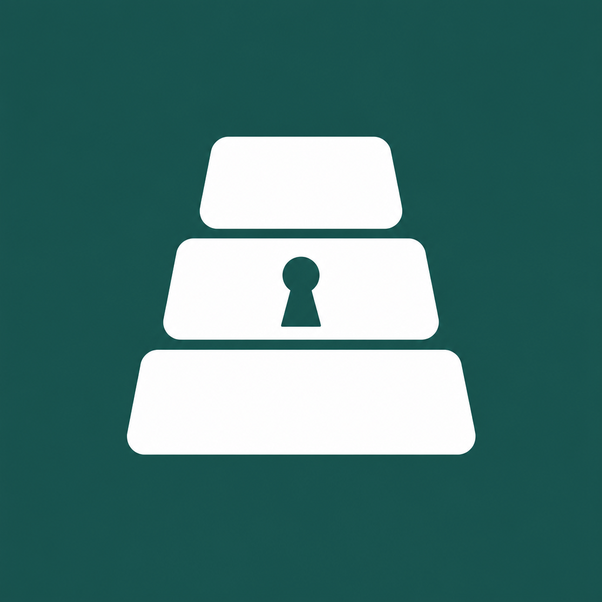

<div align="center">



# Cairn

**Secure messaging for people whose adversaries will spend serious money to read their messages.**

[](https://github.com/wlcarden/cairn-messenger/actions/workflows/ci.yml)
[](LICENSE)
[](rust-toolchain.toml)

[](docs/implementation-status.md)

</div>

Cairn is an end-to-end encrypted messenger built against the threat tier
targeted by mercenary spyware (Pegasus, Predator), forensic-extraction
tooling (Cellebrite, MSAB, GrayKey), and state intelligence services with
authority over telecom and platform operators — the threat tier documented by
research labs such as Citizen Lab and Amnesty International Security Lab. It runs on GrapheneOS-on-Pixel
and integrates existing cryptographic substrates — SimpleX's identifier-less
queue protocol, Tor, Sigstore/Sigsum transparency logs, Shamir Secret Sharing,
COSE — with original engineering at the integration boundary: a three-tier
identity model, a cryptographic trust graph with cascade-quarantine semantics,
social recovery with no centralized trustees, and a transparency-anchored
release-security stack.

> [!WARNING]
> **Status: alpha, active development, not released.** Cairn is built **for** a closed pilot (a planned
> 10–15 user cohort), pre-audit, and not yet distributed through
> any channel. The cryptographic core and the Android app run, and an
> end-to-end message round-trip has been demonstrated on two physical
> GrapheneOS Pixels over bundled Tor — but individual defenses are at varying
> maturity (several are PARTIAL; see
> [`docs/implementation-status.md`](docs/implementation-status.md)), the
> pre-pilot audit (D0011) has not happened, and there are no releases.
> **Do not rely on it for safety yet.**

## Who it's for (stated honestly)

The design brief deliberately separates three audience layers ([design
brief §1.2](docs/design-brief.md)); this README summarizes the two that bound
what v1 delivers:

- **v1 deployable population** — who v1 _actually serves_: a working estimate
  of low hundreds globally, the intersection of users meeting all four v1
  preconditions (GrapheneOS-on-Pixel, a hardware-backed operational keypair, a
  viable peer-recovery network, facilitator-supported provisioning). The pilot
  is 10–15 users from this population.
- **Threat tier the architecture is designed _against_** (a design target, not
  a population v1 reaches): journalists, lawyers, organizers, civil-society
  researchers, dissidents, abuse survivors with severed networks, and others
  whose adversaries treat their communications as worth substantial resources
  to compromise.

Cairn does not claim to reach the broad tier at v1. Populations it explicitly
does **not** serve well at v1 (co-located adversaries, users with no peer
network, non-English speakers pre-localization, cold-source contact) are named
in [design brief §1.2](docs/design-brief.md).

## Architecture

Three layers — **endpoint** (GrapheneOS-on-Pixel, a Rust core + a Kotlin/Compose
UI shell), **transport** (Tor), **communications** (SimpleX in v1; Briar joins
in v1.5) — with four commitments above the protocol layer:

1. **Three-tier identity** — master → operational → device-scoped capability
   tokens, so routine-operation compromise is bounded in scope and time.
2. **Cryptographic trust graph** — attestation, withdrawal, key-compromise
   revocation, introduction, and vouch operations, anchored as commitment-only
   (hash, not content) entries in a transparency log, with cascade-quarantine
   to contain a compromised attester.
3. **Social recovery without trustees** — Shamir-among-peers (3-of-5 default)
   _and_ paper shares, gated by pre-shared challenge phrases and a 48-hour
   delay-and-confirm window.
4. **Transparency-anchored releases** — Sigstore keyless signing, Rekor, and a
   Sigsum-anchored release log, checked by an on-device verifier (not yet wired
   into an install path — see Releases & verification below).

See [`docs/architecture-diagrams.md`](docs/architecture-diagrams.md) for the
layered, component, identity, trust-graph, recovery, and release-pipeline
diagrams.

### Workspace crates

The Rust core is a 15-crate workspace; the Kotlin/Compose app lives in
[`android/`](android/).

| Crate                                                   | Responsibility                                                                                          |
| ------------------------------------------------------- | ------------------------------------------------------------------------------------------------------- |
| [`cairn-crypto`](crates/cairn-crypto)                   | Ed25519 / X25519 / HKDF / AEAD primitives; `zeroize`/`secrecy` memory hygiene; constant-time discipline |
| [`cairn-envelope`](crates/cairn-envelope)               | Canonical CBOR + `COSE_Sign1` construction, with an external-signer (TEE) path                          |
| [`cairn-shamir`](crates/cairn-shamir)                   | Shamir Secret Sharing over GF(256) with a BLAKE3 commit-of-secret                                       |
| [`cairn-identity`](crates/cairn-identity)               | Capability-token construction (the three-tier identity model)                                           |
| [`cairn-trust-graph`](crates/cairn-trust-graph)         | Trust-graph operations + `prior_hash` chain integrity + cascade quarantine                              |
| [`cairn-recovery`](crates/cairn-recovery)               | Master-attestation of a new operational identity (social recovery)                                      |
| [`cairn-storage`](crates/cairn-storage)                 | Encrypted persistent storage (`rusqlite` + per-value AEAD)                                              |
| [`cairn-sigsum-client`](crates/cairn-sigsum-client)     | Sigsum commitment-only transparency logging                                                             |
| [`cairn-sigstore-verify`](crates/cairn-sigstore-verify) | Release-artifact verification: Fulcio + Rekor + embedded-SCT + Sigsum-anchored release log              |
| [`cairn-tor-transport`](crates/cairn-tor-transport)     | Tor transport (hand-rolled SOCKS5 + control-port; bundled `tor` on Android)                             |
| [`cairn-simplex-adapter`](crates/cairn-simplex-adapter) | SimpleX SMP adapter + the Cairn message envelope                                                        |
| [`cairn-uniffi`](crates/cairn-uniffi)                   | The curated Kotlin-facing FFI surface (UniFFI)                                                          |
| [`cairn-release`](crates/cairn-release)                 | Release producer: build/sign/ingest a verifiable `ReleaseBundle`                                        |
| [`cairn-cli`](crates/cairn-cli)                         | Host CLI composing the primitives (the minimum demoable capability)                                     |
| [`cairn-ct-bench`](crates/cairn-ct-bench)               | Constant-time benchmark (`dudect`) infrastructure                                                       |

## Building from source

Requires the pinned toolchain in [`rust-toolchain.toml`](rust-toolchain.toml)
(Rust **1.91**, auto-installed by rustup). The host workspace builds with no
external services:

```sh
cargo build --workspace
cargo test  --workspace
cargo clippy --workspace --all-targets --all-features -- -D warnings
cargo fmt --all --check
```

A self-contained end-to-end demo of the release stack (synthetic roots, no
network) — produce a signed bundle, then run the real verifier over it:

```sh
echo "demo artifact" > /tmp/app.bin
cargo run -p cairn-release -- build --apk /tmp/app.bin --version 1.0.0-demo --out /tmp/rel
cargo run -p cairn-release -- verify --bundle /tmp/rel/release-bundle.cbor --roots /tmp/rel/release-roots.json
# -> verify_release: OK
```

The **Android app** (in [`android/`](android/)) cross-compiles the Rust core
to `aarch64-linux-android` (arm64-v8a only; NDK r28+, 16 KB page size) and bundles
`tor` + the SimpleX runtime. It is built and validated on physical Pixels on
GrapheneOS; see [`docs/decisions/D0028-android-shell-build-pipeline.md`](docs/decisions/D0028-android-shell-build-pipeline.md)
for the device-build pipeline.

## Installing (closed pilot)

Cairn v1 is a **facilitator-supported closed pilot** on GrapheneOS-on-Pixel, not
a public self-serve install (see
[Who it's for](#who-its-for-stated-honestly)). Pilot participants install with a
facilitator who helps verify the build and configure recovery; the full
non-technical walkthrough is [`docs/install-guide.md`](docs/install-guide.md).

1. Download `cairn-<version>.apk` and its `.sha256` from
   [Releases](https://github.com/wlcarden/cairn-messenger/releases).
2. **Verify before installing** — `sha256sum -c cairn-<version>.apk.sha256`, and
   confirm the signing-certificate fingerprint matches (via
   `apksigner verify --print-certs`):
   `4E:5B:C1:FE:13:17:92:23:E7:36:10:5B:E6:52:AF:D7:EB:0C:97:C8:6B:20:60:A4:A8:58:04:1C:7A:7C:BB:8E`
3. Open the `.apk` on your GrapheneOS Pixel and install.

> [!WARNING]
> Alpha, pre-audit — **do not rely on it for safety yet.**

## Repository layout

```
crates/     15-crate Rust workspace (the cryptographic + protocol core)
android/    Kotlin + Jetpack Compose app (GrapheneOS-on-Pixel target)
docs/       design brief, 41 ADRs, status, diagrams, runbooks, archive
fuzz/       cargo-fuzz harnesses (libFuzzer)
.github/    CI gates + the keyless release-sign workflow
```

## Documentation

- **[`docs/design-brief.md`](docs/design-brief.md)** — the substantive design
  brief: executive summary, problem statement, threat model, architecture,
  engineering scope, and the operational/governance/funding posture.
- **[`docs/install-guide.md`](docs/install-guide.md)** — closed-pilot install
  guide: getting the app onto a GrapheneOS Pixel, with build verification.
- **[`docs/user-guide.md`](docs/user-guide.md)** — using the app: first run,
  identity & verification, pairing by QR, and conversations (with screenshots).
- **[`docs/decisions/`](docs/decisions/)** — every architectural and
  operational decision as an ADR with rationale, alternatives, and
  consequences (D0001–D0042).
- **[`docs/implementation-status.md`](docs/implementation-status.md)** — an
  honest reconciliation of _what is actually implemented_ against what the
  brief promises (IMPLEMENTED / PARTIAL / ASPIRATIONAL / DEFERRED), with code
  references. Read this before trusting any claim above.
- **[`docs/runbooks/`](docs/runbooks/)** — operator runbooks (the release
  process, keyless release-signing, CVE response, multi-party APK-key
  custody).
- **[`docs/open-questions.md`](docs/open-questions.md)** — the open-questions
  register (Q1–Q27).
- **[`metrics.md`](metrics.md)** — the empirical engineering-cadence tracker
  (the project's evidence base in place of calendar projections, per D0018).

## Releases & verification

Cairn ships an on-device release **verifier** (`cairn-sigstore-verify`) that
implements the full Sigstore-native stack — Fulcio identity, Rekor inclusion,
embedded SCT, and a Sigsum-anchored release log — so that, once releases exist,
an installed artifact can be checked against transparency-log evidence rather
than trusted blindly. Its components (Rekor inclusion, Fulcio chain validation,
embedded SCT) are tested against **real** Sigstore production/staging data; the
end-to-end `verify_release` orchestration and the Sigsum half currently run
against **synthetic** roots, and the verifier is not yet wired into an APK
install/update flow (there are no releases yet). The keyless CI signing workflow
lives at
[`.github/workflows/release-sign.yml`](.github/workflows/release-sign.yml), with
an operator guide at
[`docs/runbooks/2b-keyless-release-sign.md`](docs/runbooks/2b-keyless-release-sign.md).
The recruited Sigsum log and witness pool is funding-gated.

Releases will be published as signed APKs on [GitHub
Releases](https://github.com/wlcarden/cairn-messenger/releases); the
producer-side procedure — building, out-of-band signing, and publishing — is
documented in [`docs/runbooks/release.md`](docs/runbooks/release.md). Until the
on-device verifier is wired into the install path, a downloaded APK is verified
by its published SHA-256 checksum and APK-signature certificate fingerprint.

## Contributing

See [`CONTRIBUTING.md`](CONTRIBUTING.md). The project specifically welcomes
contributions to documentation, test infrastructure, and the reviewer
toolkit; cryptographic-engineering changes require maintainer review and
follow the project's constant-time discipline (a `dudect` smoke test runs in
CI; threshold gating runs out-of-band on dedicated hardware, per D0018). By participating you agree to the
[Contributor Covenant](https://www.contributor-covenant.org/version/2/1/code_of_conduct/)
([`CODE_OF_CONDUCT.md`](CODE_OF_CONDUCT.md)).

## Security

Report vulnerabilities privately per [`SECURITY.md`](SECURITY.md) —
**not** via public issues. For coordinated disclosure Cairn's preferred
partners are labs structured to disclose rather than sell (Citizen Lab,
Amnesty International Security Lab, Access Now, EFF Threat Lab); these are
candidate relationships, not yet established.

## License

Cairn is free software under the **GNU Affero General Public License, version
3 only** ([LICENSE](LICENSE)). The AGPL choice is deliberate and documented in
[D0019](docs/decisions/D0019-license.md).

Copyright © 2026 Cairn maintainers and contributors.
