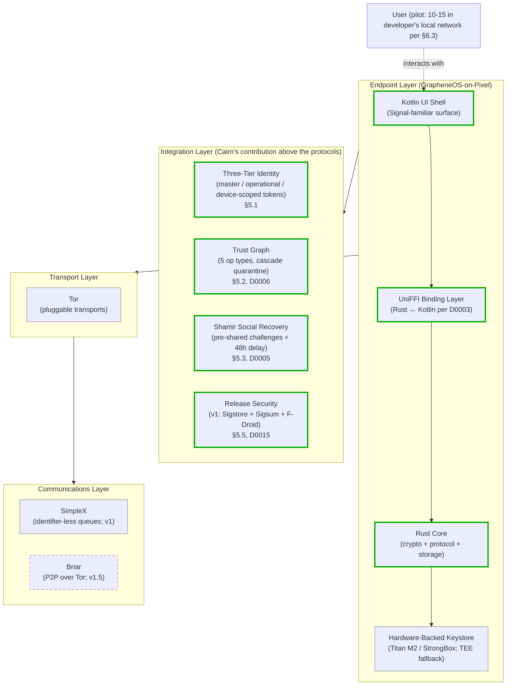
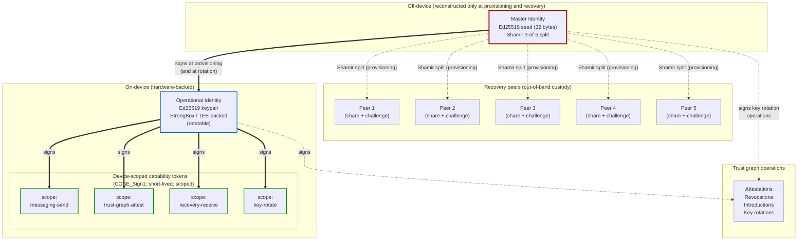
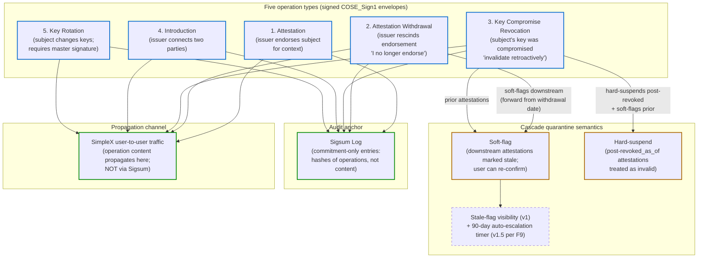
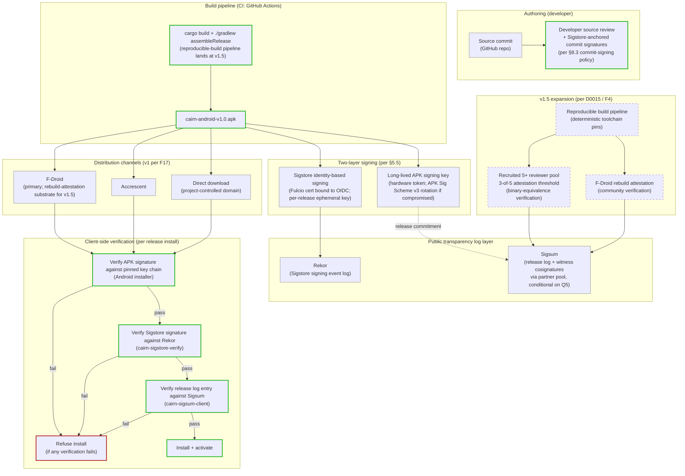

# Cairn — Architecture Diagrams

**Purpose:** visual overview of the software components, data flow, and dependency surface. Diagrams sit at implementation-planning altitude — between the orientation-level layers in [§4](design-brief.md#4-solution-overview) and the reviewer-quality detail in [§5](design-brief.md#5-architecture-detail). Cross-references point at the brief's prose where the design choices are justified.

**Notation.** Mermaid syntax — renders on GitHub, GitLab, VSCode/Cursor, and most static-site generators without external tooling. Solid arrows are direct dependencies; dashed arrows are runtime relationships (signs, attests, queries). Boxes with thick borders are project-developed components; boxes with thin borders are external dependencies. Color-coding distinguishes v1 from v1.5+ scope.

---

## 1. Top-level layered architecture

The product's three-layer mental model (per [§4.1](design-brief.md#41-architecture-in-three-layers)) plus the integration commitments sitting above the protocol substrate. v1 ships SimpleX-only; Briar joins the communications layer at v1.5 per [D0004](decisions/D0004-v1-scope-cuts.md).



The user interacts with the Kotlin UI shell; UI calls cross the UniFFI boundary into the Rust core for any security-relevant operation per [D0003](decisions/D0003-implementation-language.md). The Rust core owns secret material, protocol integrations, and storage encryption; the Kotlin layer handles only display-safe data. Hardware-backed key storage isolates operational-identity signing operations from the OS even when the OS is fully unlocked.

---

## 2. Software components (Rust core modules + Kotlin UI shell)

What gets implemented as Rust crates and Kotlin packages. This is the build-target diagram a developer planning v1 work would draw on a whiteboard. Each Rust crate maps to a `cairn-*` package in the workspace; the Kotlin side maps to Android source sets.

```mermaid
flowchart LR
    subgraph RustWorkspace["Rust Core (workspace: cairn-core/)"]
        direction TB

        subgraph CryptoLayer["Cryptographic primitives layer"]
            CairnCrypto["cairn-crypto<br/>Ed25519 + Curve25519 + ChaCha20-Poly1305<br/>(zeroize, secrecy, subtle)"]
            CairnEnvelope["cairn-envelope<br/>COSE_Sign1 + deterministic CBOR<br/>(coset crate per D0006)"]
            CairnShamir["cairn-shamir<br/>SSS over GF(256)<br/>(vsss-rs ref per Q8)"]
        end

        subgraph DomainLayer["Domain layer"]
            CairnIdentity["cairn-identity<br/>3-tier identity<br/>capability token issuance<br/>(§5.1, D0006, D0007)"]
            CairnTrustGraph["cairn-trust-graph<br/>5 op types<br/>cascade quarantine<br/>stale-flag visibility<br/>(§5.2)"]
            CairnRecovery["cairn-recovery<br/>peer challenges<br/>master reconstruction<br/>48h delay state machine<br/>(§5.3, D0005)"]
        end

        subgraph IntegrationLayer["Protocol & infrastructure integration"]
            CairnSimplex["cairn-simplex-adapter<br/>(v1 messaging substrate)"]
            CairnBriar["cairn-briar-adapter<br/>(v1.5)"]
            CairnTor["cairn-tor-transport<br/>(arti or Orbot per D0003)"]
            CairnSigsum["cairn-sigsum-client<br/>(commitment-only queries)"]
            CairnSigstore["cairn-sigstore-verify<br/>(release attestation verification)"]
        end

        CairnStorage["cairn-storage<br/>SQLite + schema versioning<br/>(property-based migration framework v1.5 per F3)"]

        CairnIdentity --> CairnCrypto
        CairnIdentity --> CairnEnvelope
        CairnTrustGraph --> CairnEnvelope
        CairnTrustGraph --> CairnSigsum
        CairnRecovery --> CairnShamir
        CairnRecovery --> CairnCrypto
        CairnSimplex --> CairnTor
        CairnIdentity --> CairnStorage
        CairnTrustGraph --> CairnStorage
    end

    subgraph UniFFIBoundary["UniFFI binding (mozilla/uniffi-rs)"]
        UDL["cairn.udl<br/>(interface definitions)"]
    end

    subgraph KotlinUI["Kotlin UI Shell (Android source set)"]
        direction TB
        AndroidShell["cairn-android-shell<br/>(lifecycle, Keystore, UnifiedPush)"]
        UIComposable["cairn-ui<br/>(Signal-familiar Compose surfaces)"]
        TrustBadges["cairn-trust-badges<br/>(verification UI per §5.6)"]
        RecoveryWalkthrough["cairn-recovery-flow<br/>(facilitator-assisted UX)"]

        UIComposable --> AndroidShell
        TrustBadges --> UIComposable
        RecoveryWalkthrough --> UIComposable
    end

    RustWorkspace --> UDL
    UDL --> KotlinUI

    Build["Build outputs:<br/>cairn-android-v1.0.apk<br/>+ Sigstore signature<br/>+ Sigsum log entry<br/>+ source archive (for §5.5 review)<br/>v1.5: + reproducible-build pipeline"]
    KotlinUI --> Build
    RustWorkspace --> Build

    classDef rustCrate stroke:#dea584,stroke-width:2px
    classDef kotlinPkg stroke:#7f52ff,stroke-width:2px
    classDef boundary stroke:#0a0,stroke-width:3px,stroke-dasharray: 5 5
    classDef output stroke:#000,stroke-width:2px

    class CairnCrypto,CairnEnvelope,CairnShamir,CairnIdentity,CairnTrustGraph,CairnRecovery,CairnSimplex,CairnBriar,CairnTor,CairnSigsum,CairnSigstore,CairnStorage rustCrate
    class AndroidShell,UIComposable,TrustBadges,RecoveryWalkthrough kotlinPkg
    class UDL boundary
    class Build output
```



**The UniFFI boundary is load-bearing.** Per [D0003](decisions/D0003-implementation-language.md), secret material does not cross the boundary — the Rust core hands the UI public keys, ciphertexts, and display-safe metadata. The `cairn.udl` interface file is what enforces this contract; the UDL only declares types and operations that are safe to pass through. The `cairn-android-shell` is the only Kotlin package allowed to touch Android Keystore APIs directly; everything else routes through Rust.

**v1.5 expansion (dashed boundaries in the diagram):** `cairn-briar-adapter` lands alongside reproducible builds; the property-based migration framework activates in `cairn-storage` when the first real schema migration arrives per [F3 in D0004](decisions/D0004-v1-scope-cuts.md).

---

## 3. Identity tier model (master → operational → capability tokens)

The three-tier model per [§5.1](design-brief.md#51-identity-model) with signing relationships. Tier separation is what makes compromise bounded in scope and time rather than total during routine operation; the reconstruction-window exposure and undefended evil-maid case are residual surfaces named in §5.1 rather than denied.



**Signing relationships:**

- Master signs operational identity at provisioning and again at rotation
- Master signs key-rotation trust-graph operations (rotation is the one operation that requires master)
- Operational identity signs all routine attestations and capability tokens
- Capability tokens authorize specific device operations (sending messages, issuing attestations, receiving recovery shares, performing rotation)

**Bounded-window exposure (per §5.1 honesty):** the master seed exists in active memory during provisioning (immediately before Shamir split) and during recovery (immediately after Shamir reconstruction). Outside those moments, the master is not on the device to extract. The `zeroize` / `secrecy` crates enforce destruction on scope exit; pinned memory prevents swap. The window cannot be eliminated entirely; recovery on a device suspected of compromise is contraindicated per §5.1 operational guidance.

---

## 4. Trust graph operation types and cascade semantics

The five operation types per [§5.2](design-brief.md#52-trust-graph) and [D0006](decisions/D0006-cryptographic-envelope.md). The withdrawal-vs-compromise split closes the cascade-laundering attack identified in the §5 adversarial review. Stale-flag _visibility_ ships at v1; the 90-day auto-escalation _timer_ defers to v1.5 per F9-partial.



**Operation envelope:** each operation is a nine-field COSE_Sign1 structure per [D0006](decisions/D0006-cryptographic-envelope.md). The canonical schema is specified in D0006 §4 (consolidated external-reads triage C1 / H1 resolution); enumerated common fields: operation_type, issuer, issuer_cert_hash, subject, prior_hash, context, strength, timestamp, expiry. Operation-type-conditional fields (revocation_kind, revoked_as_of) appear on revocation operations. **The prior-hash chain is per-(issuer, subject), not per-issuer-global** (corrected per consolidated external-reads triage C2 / H2): the chain links operations by the same issuer against the same subject; cross-subject equivocation detection depends on observers comparing operations they receive against the Sigsum commitment log, not on a single global chain. The issuer-cert-hash binding anchors each operation to the master attestation that authorized the issuer's operational key.

**Why the withdrawal/compromise split matters:** an adversary who silently compromises a user's key could otherwise re-issue attestations under their identity, then claim "I'm rotating my key" — laundering the compromised attestations into the post-rotation graph. The split makes the user state explicitly _which_ they're doing: withdrawal preserves the legitimate attestations forward (the issuer is just signaling "I no longer endorse"); compromise revocation invalidates retroactively (the key was never under user control).

**Sigsum is the audit anchor, not the propagation channel.** Operations propagate user-to-user through SimpleX traffic; what goes to Sigsum is only the commitment (hash) of each operation. This keeps issuer / subject / context out of public view while still making tampering detectable.

---

## 5. Recovery flow (sequence diagram)

The Shamir-among-peers recovery flow per [§5.3](design-brief.md#53-recovery-model) with peer-verification per [D0005](decisions/D0005-peer-verification.md). **Peer-side enforcement of the 48-hour delay-and-confirm window** (corrected per consolidated external-reads triage C5 / H5): the 48-hour timer runs on the peer device, not the fresh device. Each peer, upon completing challenge verification, schedules share release at its own device's current-time + 48h; shares are NOT delivered to the recovering device until after 48h. This closes the fresh-device clock-manipulation attack the prior architecture admitted. The pre-shared challenge raises the cost of impersonation by anyone without out-of-band challenge material; the peer-side timer prevents an adversary with the fresh device from compressing the delay window.

```mermaid
sequenceDiagram
    participant User as User<br/>(fresh device)
    participant App as Cairn App<br/>(cairn-recovery)
    participant Peer1 as Recovery Peer 1
    participant Peer2 as Recovery Peer 2
    participant Peer3 as Recovery Peer 3
    participant Sigsum as Sigsum Log

    Note over User,Sigsum: Initiation (Day 0)

    User->>App: Install Cairn, initiate recovery
    App->>User: Display public master fingerprint<br/>+ peer contact info
    User->>Peer1: Out-of-band request<br/>("I need recovery; my Cairn fingerprint is X")
    User->>Peer2: Out-of-band request
    User->>Peer3: Out-of-band request

    Note over User,Sigsum: Peer-side verification (each peer independently)

    Peer1->>User: Pre-shared challenge prompt<br/>("What was the answer we agreed on?")
    User->>Peer1: Challenge answer
    Peer1->>Peer1: Verify answer matches stored expected value<br/>(per D0005 pre-shared challenge mechanism)
    Peer1->>Peer1: Schedule share release at peer-device-clock + 48h<br/>(peer-side enforcement per C5 / H5)

    Note right of Peer1: Same flow for Peer 2 and Peer 3 independently<br/>(each peer's own clock controls its own timer)

    Peer2->>Peer2: Verify challenge + schedule share release (peer-side)
    Peer3->>Peer3: Verify challenge + schedule share release (peer-side)

    App->>Sigsum: Log "recovery initiated" commitment<br/>(visible to user's other devices, if any)
    App->>User: Recovery initiated<br/>48-hour window begins<br/>(timer runs on peer devices, not fresh device)
    Note over App: Window allows legitimate user to cancel<br/>if they didn't initiate this

    Note over User,Sigsum: 48-hour delay window (peer-side enforced)

    alt User cancels within 48 hours
        User->>Peer1: Cancel through any out-of-band channel
        User->>Peer2: Cancel through any out-of-band channel
        User->>Peer3: Cancel through any out-of-band channel
        Peer1->>Peer1: Discard scheduled share release
        Peer2->>Peer2: Discard scheduled share release
        Peer3->>Peer3: Discard scheduled share release
        App->>Sigsum: Log "recovery cancelled" (optional)
        Note over App: No shares delivered; no master reconstruction
    else 48 hours elapse (per peer's own clock)
        Peer1->>App: Release encrypted share<br/>(via SimpleX or out-of-band)
        Peer2->>App: Release encrypted share
        Peer3->>App: Release encrypted share
        App->>App: Reconstruct master seed from shares<br/>(secrecy-wrapped pinned memory; atomic re-split per C10)
        App->>App: Re-split master, distribute new shares to peers<br/>(atomic — all peers receive or none)
        App->>App: Generate new operational identity<br/>(only after re-split completes)
        App->>App: Sign new operational identity with master
        App->>App: Zeroize master from memory
        App->>Sigsum: Log "key rotation" operation<br/>(propagates via trust graph)
    end

    Note over User,Sigsum: Day 2 onward: recovery complete; new operational identity active
```

**Online Sigsum dependency at v1.** Per [§9.2](design-brief.md#92-recovery-and-trust-graph-risks) and D0014, v1 recovery requires online connectivity to Sigsum — the trust-graph evaluation queries Sigsum directly. v1.5 adds local caching that mitigates the most common case but does not address full-offline recovery.

**Excluded populations at v1.** Per [D0014](decisions/D0014-non-peer-recovery.md), users whose threat condition precludes a peer-recovery network (sex workers under criminalization with co-prosecuted peers; abuse survivors with severed networks; isolated dissidents; etc.) are out of scope for v1 recovery as architecturally designed. Candidate v1.x/v2 paths (printed paper shares; time-locked self-recovery; single-trustee attorney-privilege; explicit no-recovery option) are named in D0014.

---

## 6. Release-security pipeline (v1)

The v1 release-security stack per [§5.5](design-brief.md#55-updates-and-release-security) and [D0015](decisions/D0015-v1-release-security-posture.md). Developer signing + public log audit + multi-channel distribution; the recruited 5+/3-of-5 reviewer pool defers to v1.5 alongside reproducible builds per F4.



**v1 supply-chain gap (acknowledged per D0015 and D0013 pilot consent):** developer source review does not detect a compromised build pipeline producing a malicious binary from clean source. The v1 release log + witness cosignatures detect _broad_ attacks (an adversary cannot deliver a signed update without a corresponding Sigsum entry) but do not catch a build-pipeline compromise that produces logged-but-malicious binaries. v1.5's reproducible-build + recruited reviewer pool + F-Droid rebuild attestation closes this gap with binary-equivalence multi-party verification.

**The witness pool _is_ a v1 commitment** even though the recruited reviewer pool defers. Per D0015, witness cosignatures via the partner pool are the v1 mechanism for detecting Sigsum log tampering by the log operator; recruitment is conditional on Q5 partner outreach per §8.6.

---

## 7. External dependency surface and trust roots

What Cairn integrates vs what Cairn builds. The dependency surface is the trust placement the user inherits when they use Cairn — per [§3.4 Trust Roots](design-brief.md#34-trust-roots). All external dependencies are upstream-maintained projects whose continued operation Cairn does not control.

```mermaid
flowchart TB
    subgraph CairnDeveloped["Cairn-developed components<br/>(this is what we build)"]
        direction TB
        CairnRust["Rust core<br/>(cairn-crypto, cairn-envelope, cairn-shamir,<br/>cairn-identity, cairn-trust-graph,<br/>cairn-recovery, cairn-storage)"]
        CairnAdapters["Protocol adapters<br/>(cairn-simplex-adapter, cairn-tor-transport,<br/>cairn-sigsum-client, cairn-sigstore-verify)"]
        CairnKotlin["Kotlin UI shell<br/>(cairn-ui, cairn-android-shell,<br/>cairn-trust-badges, cairn-recovery-flow)"]
    end

    subgraph CryptoStandards["Cryptographic primitives & standards"]
        RFC8032["RFC 8032 Ed25519"]
        RFC8439["RFC 8439 ChaCha20-Poly1305"]
        RFC9052["RFC 9052 COSE"]
        RFC8949["RFC 8949 CBOR (det.)"]
        Shamir["Shamir 1979 SSS"]
    end

    subgraph RustEcosystem["Rust ecosystem (audited libraries)"]
        Coset["coset crate<br/>(COSE_Sign1)"]
        Zeroize["zeroize / secrecy / subtle<br/>(memory hygiene)"]
        Vsss["vsss-rs candidate<br/>(SSS primitive)"]
        Arti["arti<br/>(Rust Tor client)"]
    end

    subgraph ProtocolSubstrates["Protocol substrates (delegated per §4.3)"]
        SimpleXSubstrate["SimpleX<br/>(identifier-less queue protocol)"]
        BriarSubstrate["Briar<br/>(P2P over Tor; v1.5)"]
        TorSubstrate["Tor Project<br/>(network + pluggable transports)"]
    end

    subgraph PlatformSubstrate["Platform substrate"]
        GrapheneOSPlat["GrapheneOS<br/>(verified boot; sandboxing)"]
        Pixel["Pixel hardware<br/>(Titan M2 secure element)"]
        StrongBoxAPI["Android Keystore<br/>(StrongBox / TEE)"]
    end

    subgraph ReleaseInfra["Release-security infrastructure (per D0015 + §5.5)"]
        SigstoreInfra["Sigstore<br/>(Fulcio + cosign)"]
        RekorInfra["Rekor<br/>(transparency log)"]
        SigsumInfra["Sigsum<br/>(witness-cosigned log)"]
        OIDC["OIDC provider<br/>(jurisdictional posture; Q11/Q24)"]
    end

    subgraph DistributionInfra["Distribution channels"]
        FDroidDist["F-Droid<br/>(community rebuild substrate)"]
        AccrescentDist["Accrescent"]
        DirectDLDist["Direct download<br/>(project domain)"]
    end

    subgraph PushInfra["Push notification (v1.5+ UI)"]
        UnifiedPushInfra["UnifiedPush protocol<br/>+ distributor (NTFY etc.)"]
    end

    CairnRust --> Coset
    CairnRust --> Zeroize
    CairnRust --> Vsss
    CairnAdapters --> Arti
    CairnAdapters --> SimpleXSubstrate
    CairnAdapters --> BriarSubstrate
    CairnAdapters --> TorSubstrate
    CairnAdapters --> SigstoreInfra
    CairnAdapters --> RekorInfra
    CairnAdapters --> SigsumInfra
    SigstoreInfra --> OIDC

    CairnKotlin --> StrongBoxAPI
    StrongBoxAPI --> Pixel
    CairnKotlin --> GrapheneOSPlat
    CairnKotlin --> UnifiedPushInfra

    CairnRust -.->|implements| RFC8032
    CairnRust -.->|implements| RFC8439
    CairnRust -.->|implements| RFC9052
    CairnRust -.->|implements| RFC8949
    CairnRust -.->|implements| Shamir

    CairnDeveloped --> FDroidDist
    CairnDeveloped --> AccrescentDist
    CairnDeveloped --> DirectDLDist

    classDef projectDev stroke:#0a0,stroke-width:3px
    classDef standard stroke:#666
    classDef rustLib stroke:#dea584
    classDef substrate stroke:#06c,stroke-width:2px
    classDef platform stroke:#a60,stroke-width:2px
    classDef releaseInfra stroke:#80c
    classDef v15 stroke-dasharray: 5 5

    class CairnRust,CairnAdapters,CairnKotlin projectDev
    class RFC8032,RFC8439,RFC9052,RFC8949,Shamir standard
    class Coset,Zeroize,Vsss,Arti rustLib
    class SimpleXSubstrate,TorSubstrate substrate
    class GrapheneOSPlat,Pixel,StrongBoxAPI platform
    class SigstoreInfra,RekorInfra,SigsumInfra,OIDC releaseInfra
    class FDroidDist,AccrescentDist,DirectDLDist substrate
    class BriarSubstrate,UnifiedPushInfra v15
```



**The honest framing per §4.1's dependency-surface paragraph:** every external box in this diagram is a trust placement Cairn inherits. The user trusts not just Cairn but also GrapheneOS, Pixel hardware, Tor's anti-censorship work, SimpleX's metadata posture, Sigstore's OIDC chain (with U.S. jurisdictional posture per §5.5 / Q11 / Q24), Rekor's single-operator log model, Sigsum's witness pool, F-Droid's policy decisions, and (for v1.5+) Accrescent's continued operation. The §3.4 Trust Roots enumeration is the brief's audit of these placements.

---

## 8. Build/test/release pipeline (developer workflow)

How the developer actually produces a release. This is the day-to-day workflow for v1; v1.5 adds the reproducible-build verification step.

```mermaid
flowchart LR
    subgraph DevLoop["Development loop"]
        Code["Code change<br/>(Rust core or Kotlin UI)"]
        UnitTest["cargo test<br/>(property-based crypto tests +<br/>fuzz tests for COSE/CBOR parsers)"]
        IntegTest["./gradlew connectedAndroidTest<br/>(UniFFI binding integration tests)"]
        DiffTest["Differential tests<br/>(against SimpleX reference where shared)"]
        StaticAnal["clippy + detekt + ktlint"]

        Code --> UnitTest --> IntegTest --> DiffTest --> StaticAnal
    end

    subgraph PreCommit["Pre-commit"]
        Format["cargo fmt + ktfmt"]
        SignCommit["Sigstore-anchored commit signature<br/>(required for security-critical paths per §8.3)"]
        Format --> SignCommit
    end

    subgraph CI["Continuous integration"]
        CIRun["GitHub Actions<br/>(runs full test suite on each PR)"]
        CIRun --> ReviewQueue["External-reviewer-pool review queue<br/>(security-critical changes; v1.5+ for release attestation)"]
    end

    subgraph ReleaseProcess["Release process (per §5.5 / §8.2)"]
        TagRelease["git tag v1.x.y<br/>+ developer source review<br/>(per D0015)"]
        BuildAPK["Build APK<br/>(reproducible-build pipeline at v1.5)"]
        SignAPK["Sign APK<br/>(long-lived key + Sigstore identity)"]
        LogRekor["Log to Rekor"]
        LogSigsum["Log to Sigsum<br/>(witness cosignatures)"]
        Publish["Publish to F-Droid + Accrescent + direct download"]

        TagRelease --> BuildAPK --> SignAPK --> LogRekor --> LogSigsum --> Publish
    end

    StaticAnal --> Format
    SignCommit --> CIRun
    ReviewQueue --> TagRelease

    classDef devWork stroke:#0a0,stroke-width:2px
    classDef ci stroke:#06c
    classDef release stroke:#80c,stroke-width:2px

    class Code,UnitTest,IntegTest,DiffTest,StaticAnal,Format,SignCommit devWork
    class CIRun,ReviewQueue ci
    class TagRelease,BuildAPK,SignAPK,LogRekor,LogSigsum,Publish release
```



**v1 self-audit and tooling commitments (per §8.5).** During implementation: property-based testing for the trust-graph CRDT and operation envelope; fuzz testing for COSE/CBOR parsers, Shamir reconstruction, and the capability-token verifier; known-answer tests matching test vectors from RFC 8032 / RFC 9052; differential testing against the SimpleX reference where Cairn reuses its protocol semantics; continuous integration on every commit; clippy + equivalent Kotlin static analysis.

**Pre-pilot audit gates pilot deployment (per D0011 / F5).** The narrowed two-surface scope (COSE_Sign1 envelope construction + recovery-flow cryptographic operations) is the external attestation that pilot users receive on top of the developer's own self-audit + the source-review process above.

---

## Reading guide by developer role

- **Rust core developer:** start at diagram 2 (software components), then 3 (identity model) and 4 (trust graph operations) for the cryptographic surface the core implements. Diagram 1 gives the context where the core fits.
- **Kotlin UI developer:** start at diagrams 1 (layers) and 2 (component breakdown), focusing on the UniFFI boundary and the Kotlin packages. Diagram 5 (recovery sequence) shows the most complex UX flow.
- **Release / infrastructure engineer:** start at diagram 6 (release pipeline) and 8 (developer workflow), then 7 (dependency surface) for trust placements the release stack rests on.
- **Security auditor (pre-pilot scope):** diagrams 3, 4, and 5 cover the surfaces in the F5-narrowed pre-pilot audit scope (COSE_Sign1 envelope construction + recovery-flow crypto). Diagram 2 shows the Rust crates the audit examines.
- **First-time technical reviewer:** read in order 1 → 2 → 3 → 4 → 5 → 6 → 7 → 8. Each diagram references the brief section where the design choice is justified.

---

## Notes on diagram conventions

- **Mermaid syntax** — version-controlled as text; renders on GitHub/GitLab/VSCode without plugins. Update diagrams when the architecture changes; the diff makes intent visible.
- **Solid vs dashed arrows** — solid is direct dependency (component A needs component B); dashed is runtime relationship (signs, attests, queries).
- **Box border style** — thick green border for project-developed components; thin grey for external dependencies; dashed for v1.5+ scope (not yet built).
- **Cross-references** — every diagram cross-links to the brief section and decision documents where the architectural choice is justified.
- **Living document** — this file should be updated alongside §5 architecture detail changes. Diagrams that drift from prose are worse than no diagrams.
