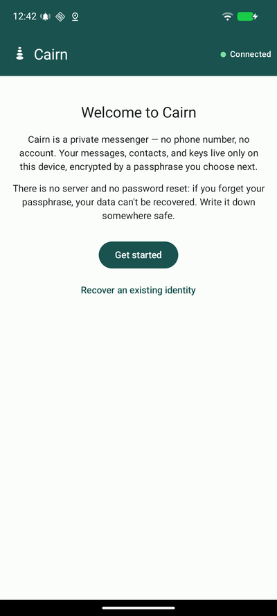
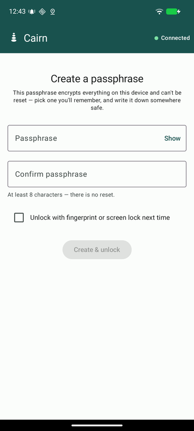
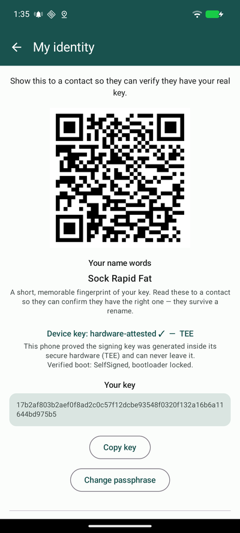
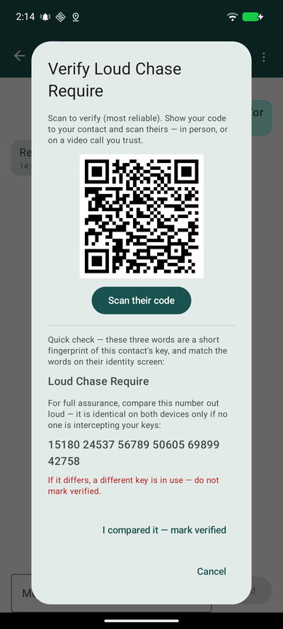
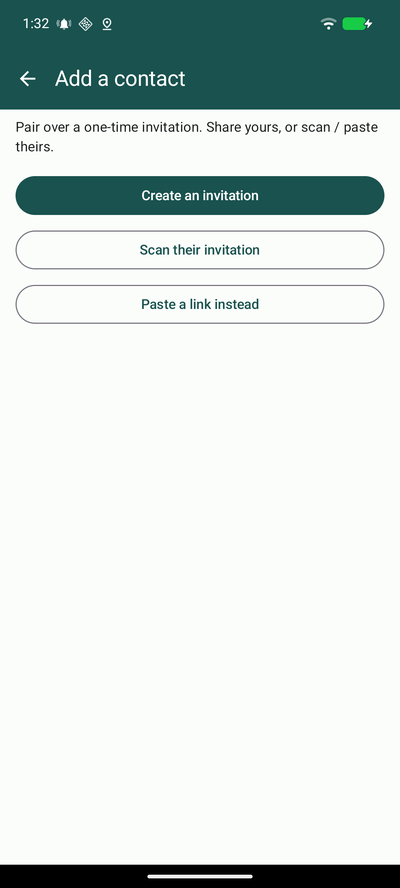
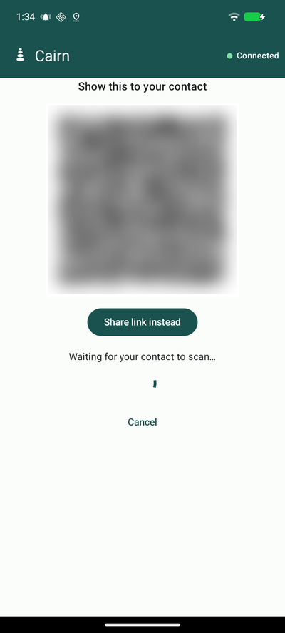
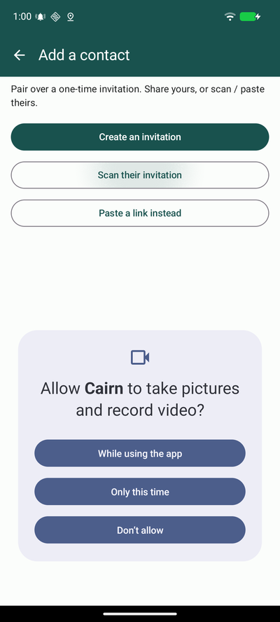
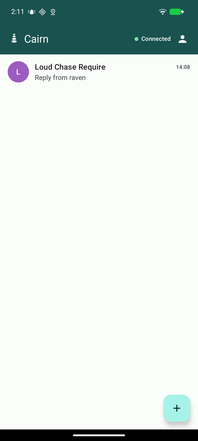
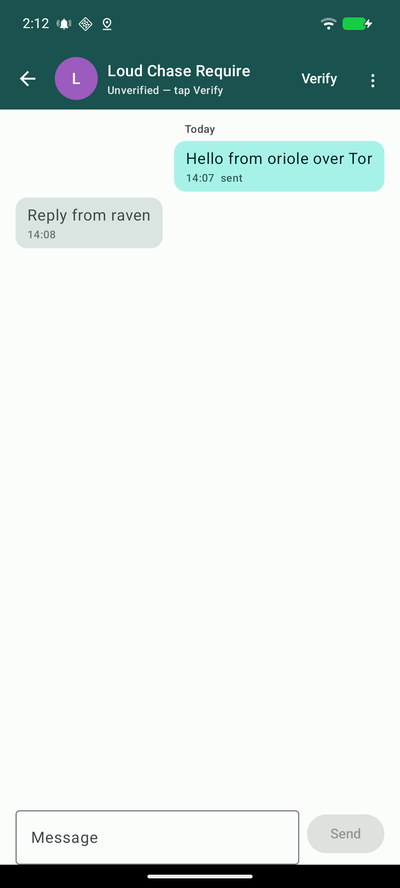

# Cairn user guide

> [!WARNING]
> **Cairn is alpha and pre-audit** — a facilitator-supported closed pilot. **Do
> not rely on it for safety yet.** This guide shows how the app works day to
> day; for getting it onto a device, see [`install-guide.md`](install-guide.md).
>
> Screenshots use throwaway **demo** identities — your names, keys, and messages
> will differ.

This walks through Cairn on a GrapheneOS Pixel: creating your identity, adding
and verifying a contact, and messaging. Do first-run setup **with your
facilitator**.

## 1. First run — your passphrase

There is **no sign-up** — no phone number, no account, no email. The first
screen explains the model; tap **Get started** (or **Recover an existing
identity** if you're restoring a device — see [Recovery](#recovery)).

Next, choose a **passphrase** that encrypts everything on the device:

There is **no reset and no server** — if you forget this passphrase, your data
cannot be recovered, so write it down somewhere safe. You can optionally enable
**unlock with fingerprint / screen lock** for convenience.

🔍 Why no account or server?

Cairn has no central account server, so there is no account database to breach
or subpoena and nothing tying your identity to a phone number. Keys are
generated and kept on the device (in secure hardware — see
[§2](#2-your-identity--verifying-contacts)). Messages route over Tor through
SimpleX's identifier-less relay queues: relays forward your traffic but never
see a phone number, an account, or your contact list, and each relay sees only
the messages passing through it. The trade-off is the one the screen warns
about: no server also means no password reset. See the
[design brief](design-brief.md).

## 2. Your identity & verifying contacts

Open **My identity** (the person icon, top-right). This is what you show others
so they can confirm they're really talking to you:

- **Your name words** (e.g. _Sock Rapid Fat_) — a short, memorable fingerprint
  of your key. They survive a rename, so a contact can always re-check them.
- **Device key: hardware-attested · TEE** — your signing key was generated
  inside the phone's secure hardware and can never leave it.
- **Your key** + **Copy key** — the full public key, plus a QR to show in
  person.

**Verify a contact** before trusting a conversation. Tap **Verify**:

Three ways, strongest first:

1. **Scan their code** in person (most reliable).
2. **Compare the three name words** against their identity screen.
3. **Read the long number out loud** — it is identical on both devices only if
   no one is intercepting your keys. **If it differs, do not mark verified.**

🔍 What the words and the number actually are

Both are fingerprints of the keys protecting the conversation — the words are an
easy-to-say short form, the number is the full safety number. Comparing them
out-of-band (in person, or a call you trust) is how you detect a
machine-in-the-middle: an interceptor would have to substitute keys, which
changes the fingerprint. Same idea as Signal's safety numbers.

## 3. Adding a contact

Cairn pairs over a **one-time invitation**. From the conversations list, tap
**+**:

Pairing is mutual — one person **creates** an invitation, the other **scans**
it:

- **Create an invitation** → show the QR to your contact (or _Share link
  instead_ to send it another way):

  

  _(The QR is blurred here — it is a real one-time pairing code.)_

- **Scan their invitation** → point your camera at their QR (grant the camera
  prompt the first time). You can also **Paste a link** if they sent one.

  

Once it connects, the conversation opens on both phones.

🔍 One-time invitations

An invitation is a single-use pairing handle, not a permanent address — after
you pair, it's spent. There is no searchable directory of users; you can only
reach people you've exchanged an invitation with, which is what keeps the
network closed to cold contact.

## 4. Conversations

Paired contacts appear in your conversations list with the latest message:

Open one to chat. Messages are end-to-end encrypted and routed over Tor:

The **"Unverified — tap Verify"** banner stays until you've verified the contact
(see [§2](#2-your-identity--verifying-contacts)). Verify before treating a
conversation as trusted.

## Recovery

If you lose your device you can restore your identity from shares held by your
peers, and you can entrust shares to verified contacts to help them later. These
social-recovery flows are set up **with your facilitator** as part of the pilot,
and a full walkthrough will be added here. (A contact's recovery options appear
once that contact is **verified**.)

## What this guide doesn't cover yet

This is an early guide for a pre-audit pilot. Not yet documented: the full
recovery walkthrough, vouching and introductions between contacts, and
quick-unlock management. For what is actually implemented vs. planned, see
[`implementation-status.md`](implementation-status.md).

## See also

- [`install-guide.md`](install-guide.md) — getting Cairn onto a device
- [`design-brief.md`](design-brief.md) — how and why it is built this way
- [`../SECURITY.md`](../SECURITY.md) — reporting a security problem
